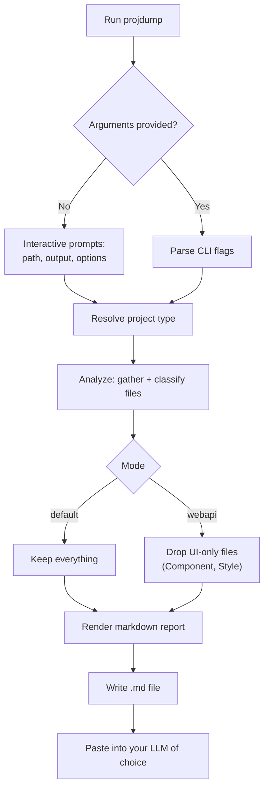
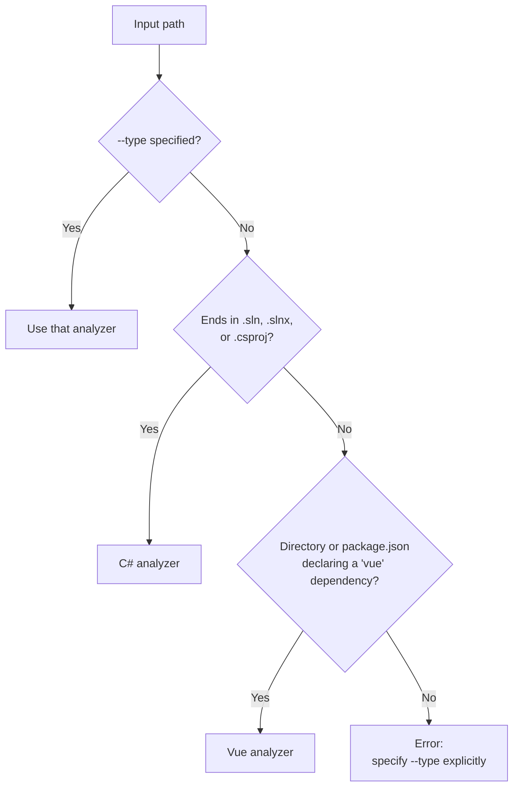

# projdump

A .NET CLI tool that distils a C# solution/project or a Vue project into a single structured markdown file, making it easy to provide codebase context to an LLM.

- [What it does](#what-it-does)
- [Usage](#usage)
- [How it works](#how-it-works)
- [How project type is detected](#how-project-type-is-detected)
- [What gets excluded](#what-gets-excluded)
- [Building](#building)
- [Project structure](#project-structure)
- [Testing](#testing)
- [Adding a new project type](#adding-a-new-project-type)
- [Output structure](#output-structure)
- [Sample output](#sample-output)
- [Token estimate](#token-estimate)
- [License](#license)

## What it does

Point `projdump` at a C# solution/project or a Vue project and it produces a self-contained markdown document containing:

- **Project summary** — file extension breakdown table
- **Project structure** — full relative file tree
- **Documentation** — contents of any `.md` files found
- **Solution configuration** — the `.sln`/`.slnx` file itself (C# solutions only)
- **Project dependencies** — `.csproj` contents, or `package.json` for Vue
- **Configuration files** — `appsettings.json`, `vite.config.ts`, `.env`, and other well-known config files
- **App code** — source files ordered by significance (entry points → interfaces/routing → models → helpers → everything else)
- **Token estimate** — a rough token count in the header so you know if you're within context window budget before pasting

It supports two project types out of the box, C# and Vue, and a focus **mode** that trims the report to a specific concern (currently a WebAPI mode for C#). Both are designed to be extended without touching the rest of the tool.

## Usage

```
projdump <path> [output-path] [options]
```

Run with no arguments at all for **interactive mode** — it'll prompt you for the path, output location, and options one at a time:

```
projdump
```

### Options

| Flag | Description |
| :--- | :--- |
| `--slim` | Omit file contents; list filenames and sizes only |
| `--exclude-tests` | Exclude test projects and test files |
| `--scope <dir>` | Restrict to a subdirectory, relative to the project root |
| `--type <csharp\|vue>` | Force project type (auto-detected by default) |
| `--mode <default\|webapi>` | Report focus mode (`webapi` is C#-only for now) |
| `--help`, `-h` | Show usage |

### Examples

```bash
# Dump an entire solution — writes MyApp-app-solution.md alongside MyApp.sln
projdump MyApp.sln

# Dump a single project — writes MyApp.Api-app-project.md
projdump src/MyApp.Api/MyApp.Api.csproj

# Dump a Vue project — writes <package.json name>-app-project.md
projdump ./frontend

# Write output to a specific file or directory
projdump MyApp.sln C:\context\myapp-context.md
projdump MyApp.sln C:\context\

# Skip tests, and scope to one project within a solution
projdump MyApp.sln --exclude-tests --scope src/MyApp.Api

# Focus the report on backend API surface (C# only)
projdump MyApp.Api.csproj --mode webapi
```

The output filename is always `<project-name>-app-solution.md` or `<project-name>-app-project.md` (plus `-slim` if that flag is set) — the project name comes from the `.sln`/`.csproj` file name for C#, or the `name` field in `package.json` for Vue.

## How it works



## How project type is detected

If `--type` isn't given, `projdump` tries each supported project type in turn until one claims the input:



## What gets excluded

To keep the output clean and token-efficient, the following are always skipped:

| Category | Examples |
| :--- | :--- |
| Build artifacts (C#) | `bin/`, `obj/` |
| Build output (Vue) | `dist/` |
| Auto-generated code (C#) | `*.designer.cs`, `*.g.cs`, `*.g.i.cs` |
| Boilerplate (C#) | `AssemblyInfo.cs`, `GlobalUsings.cs` |
| Minified assets (Vue) | `*.min.js`, `*.min.css` |
| EF Core migrations (C#) | `Migrations/` |
| VCS / editor folders | `.git/`, `.vscode/`, `.vs/` |
| Dependencies | `node_modules/`, `package-lock.json`, `yarn.lock`, `pnpm-lock.yaml` |

With `--exclude-tests`, these are also dropped: `Tests/`, `Test/`, `Specs/`, `UnitTests/`, `IntegrationTests/`, `__tests__/`, `e2e/` folders, plus `*Tests.cs`, `*Spec.cs`, `*.spec.ts`, `*.test.js` and similar naming conventions.

## Building

Requires the [.NET 10 SDK](https://dotnet.microsoft.com/download) or later.

```bash
git clone https://github.com/your-username/projdump.git
cd projdump
dotnet build
```

Run directly (the solution has two projects, so `dotnet run` needs to know which one):

```bash
dotnet run --project projdump.Terminal -- MyApp.sln
```

Or publish a self-contained executable:

```bash
dotnet publish projdump.Terminal -c Release -r win-x64 --self-contained
```

Run the test suite:

```bash
dotnet test
```

## Project structure

```
projdump.slnx
projdump.Engine/           # analysis, filtering, and rendering — no console I/O
  Core/                    # ProjectAnalysis model, registry, extension points
  Analyzers/                # one folder per supported project type
  Modes/                    # report-focus filters (default, webapi)
  Rendering/                # markdown generation
projdump.Terminal/         # the CLI shell — argument parsing, prompts, console output
projdump.Engine.Tests/     # NUnit tests for projdump.Engine
projdump.Terminal.Tests/   # NUnit tests for projdump.Terminal
```

`projdump.Engine` has no dependency on the console — it's a plain class library, so a future GUI front end could reference it directly instead of `projdump.Terminal`.

## Testing

Two NUnit projects, one per assembly:

- `projdump.Engine.Tests` — classifiers, exclusion filters, the registry, modes, the renderer
- `projdump.Terminal.Tests` — argument parsing, filename sanitization, and an end-to-end run through `Program.Execute`

```bash
dotnet test
```

Most of the suite is small, isolated unit tests with no file system involved — `FileInfo` objects built from plain strings, fake implementations of the internal filter/detector interfaces, that kind of thing. A smaller set are integration tests, used only where the code genuinely can't avoid touching disk: the renderer reads file content and size directly, the analyzers walk a real directory tree, and `Program.Execute` is the actual pipeline end to end. Those use a `TempProjectDirectory` helper (one per test project) that creates a unique temp folder and deletes it on `Dispose`, so `using var temp = new TempProjectDirectory();` at the top of a test guarantees cleanup even if an assertion fails partway through.

A couple of things worth knowing if you're adding tests:

- Most of what's tested (`CSharpFileClassifier`, the exclusion filters, `FormatHelpers`, etc.) is `internal`, not `public` — each engine/CLI project grants its test project access via `InternalsVisibleTo` rather than widening the public API just for testing.
- Never pass a bare relative path (`new FileInfo("Foo.cs")`) into a path-segment check. It resolves against the test runner's working directory, typically a build output path like `bin/Debug/net10.0/`, which itself contains segments like `bin` that these filters look for — silent false positives depending on where the repo happens to live. Use `TestSupport/FakePaths.Combine(...)` in `projdump.Engine.Tests`, which anchors the path under the OS temp directory instead.
- Interactive mode's actual prompt loop (`Console.ReadLine`) isn't covered — that would need `Console.In`/`Out` abstracted behind an interface, which felt like more surgery than the testing pass warranted. Worth a look if it becomes a priority.

## Adding a new project type

Every project type implements one interface:

```csharp
public interface IProjectAnalyzer
{
    string TypeKey { get; }                              // e.g. "csharp", "vue"
    IReadOnlyCollection<string> SupportedModes { get; }   // which report modes this type supports

    bool CanHandle(string inputPath);                     // "could this input plausibly be my type?"

    // Validates the input, gathers and classifies files. Throws ProjectAnalysisException for bad input.
    ProjectAnalysis Analyze(string inputPath, ProjectAnalysisOptions options);
}
```

To add support for a new stack:

1. Create `Analyzers/<YourType>/<YourType>Analyzer.cs` implementing `IProjectAnalyzer`.
2. Write a `CanHandle` check (extension, marker file, folder contents — whatever identifies your stack).
3. In `Analyze`, gather files and tag each one with a `FileRole` (`EntryPoint`, `Model`, `Config`, etc.) — that's what lets report modes filter intelligently without knowing anything about your stack.
4. Register it in `Program.cs`'s `ProjectTypeRegistry` alongside the existing analyzers.

The renderer, the mode system, and the CLI/interactive layer are all written against `ProjectAnalysis` and don't need to change for a new type to work.

## Output structure

```
# MyApp - App Solution

> Estimated tokens: ~12,400 _(character count ÷ 4 — treat as a rough guide)_

## Project Summary
## Project Structure
## Documentation
## Solution Configuration
## Project Dependencies
## Configuration
## App Code
```

(Vue projects skip the "Solution Configuration" section — there's no solution file — and "Project Dependencies" shows `package.json` instead of `.csproj` files.)

## Sample output

The first section or two of a real run against a small ASP.NET Core API, trimmed for length:

````markdown
# MyApp.Api - App Project

> **Estimated tokens:** ~8,214  _(character count ÷ 4 — treat as a rough guide)_

## Project Summary
| File Extension | Count |
| :--- | :--- |
| .cs | 14 |
| .json | 3 |
| .md | 1 |

## Project Structure
```text
MyApp.Api.csproj
Program.cs
appsettings.json
Controllers/OrdersController.cs
Models/Order.cs
Models/OrderDto.cs
Services/IOrderService.cs
Services/OrderService.cs
```

## Project Dependencies
### MyApp.Api.csproj
**Path:** `MyApp.Api.csproj`

```xml
<Project Sdk="Microsoft.NET.Sdk.Web">
  ...
</Project>
```

## App Code
### Program.cs
**Path:** `Program.cs`

```csharp
var builder = WebApplication.CreateBuilder(args);
...
```
````

## Token estimate

The estimate at the top of every output is calculated as `character count ÷ 4`, a reasonable heuristic for mixed code and prose across GPT and Claude tokenisers. Treat it as a ballpark — actual token counts will vary by model.

## License

MIT