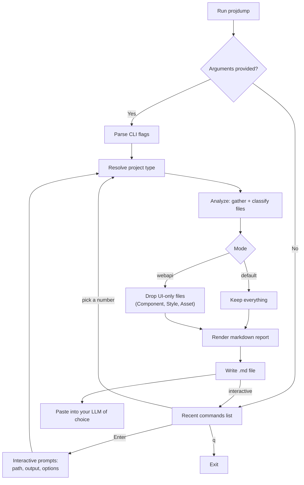
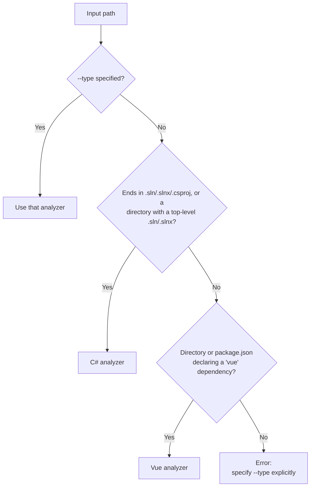

# projdump

A .NET CLI tool that distils a C# solution/project or a Vue project into a single structured markdown file, making it easy to provide codebase context to an LLM.

- [What it does](#what-it-does)
- [Usage](#usage)
- [How it works](#how-it-works)
- [How project type is detected](#how-project-type-is-detected)
- [How the README is found](#how-the-readme-is-found)
- [What gets excluded](#what-gets-excluded)
- [Building](#building)
- [Project structure](#project-structure)
- [Testing](#testing)
- [Adding a new project type](#adding-a-new-project-type)
- [Output structure](#output-structure)
- [Sample output](#sample-output)
- [Token estimate](#token-estimate)
- [License](#license)

## What it does

Point `projdump` at a C# solution/project (or a folder containing one), or a Vue project, and it produces a self-contained markdown document containing:

- **Project summary** — file extension breakdown table
- **Project structure** — full relative file tree
- **Documentation** — contents of any `.md` files found, plus the project's README even when it lives further up the tree
- **Solution configuration** — the `.sln`/`.slnx` file itself (C# solutions only)
- **Project dependencies** — `.csproj` contents, or `package.json` for Vue
- **Configuration files** — `appsettings.json`, `vite.config.ts`, `.env`, and other well-known config files
- **App code** — source files ordered by significance (entry points → interfaces/routing → models → helpers → everything else)
- **Token estimate** — a rough token count in the header so you know if you're within context window budget before pasting

It supports two project types out of the box, C# and Vue, and a focus **mode** that trims the report to a specific concern (currently a WebAPI mode for C#). Both are designed to be extended without touching the rest of the tool.

## Usage

```
projdump <path> [output-path] [options]
```

Run with no arguments at all for **interactive mode** — it'll prompt you for the path, output location, and options one at a time:

```
projdump
```

Interactive mode **loops**: after each run it drops you back at the recent commands list, so you can dump several projects in a row without restarting.

- **Opens straight on your recent commands.** Pick a number to re-run one, press Enter to build a new command, or `q` to quit. With no history yet it goes straight to the normal prompts, where a blank path is the way out.
- **Skips the mode question for solutions.** Point it at a `.sln`/`.slnx` and `--mode` won't be asked, since a mode applies per-project and a solution usually spans more than one.
- **Only asks to save genuinely new commands.** Re-running one from the list, or typing one that matches an existing entry flag-for-flag, skips the question — it's already saved.
- **Promotes whatever you just ran** to the top of the list, so your most-used commands stay within reach.

Each entry renders as `#. [date] Solution/Project | flags | output path`, colour-coded so the list stays scannable. The input path isn't shown — the solution and project names identify an entry well enough, and full paths make the list hard to read. For a C# project the solution name comes from the nearest `.sln`/`.slnx` above it; for Vue, the folder holding `package.json` stands in for the solution and the `name` field is the project. Either half is dropped when it can't be resolved, so a standalone `.csproj` with no solution nearby shows just the project name.

Saved commands live in `<ApplicationData>/projdump/command-history.json` (`%APPDATA%\projdump\command-history.json` on Windows) as a plain JSON array, ordered most-recent-first. Nothing is rotated or capped — it grows for as long as you keep saving — but a given command is only ever stored once: re-running an identical one moves it to the top rather than adding a duplicate. Two commands count as identical when every flag matches, so `MyApp.sln --slim` and `MyApp.sln` are tracked as separate entries. Repeated `--exclude-dir` values are compared as a set, so the order you typed them in doesn't split one command into two.

### Options

| Flag | Description |
| :--- | :--- |
| `--slim` | Omit file contents; list filenames and sizes only |
| `--exclude-tests` | Exclude test projects and test files |
| `--find-readme` | Look in parent directories for a README when the project has none |
| `--scope <dir>` | Restrict to a subdirectory, relative to the project root |
| `--exclude-dir <n>` | Exclude a directory by name, anywhere in the tree (repeatable) |
| `--type <csharp\|vue>` | Force project type (auto-detected by default) |
| `--mode <default\|webapi>` | Report focus mode (`webapi` is C#-only for now) |
| `--help`, `-h` | Show usage |

### Examples

```bash
# Dump an entire solution — writes MyApp-app-solution.md alongside MyApp.sln
projdump MyApp.sln

# Dump a single project — writes MyApp.Api-app-project.md
projdump src/MyApp.Api/MyApp.Api.csproj

# Dump a Vue project — writes <package.json name>-app-project.md
projdump ./frontend

# Write output to a specific file or directory
projdump MyApp.sln C:\context\myapp-context.md
projdump MyApp.sln C:\context\

# Skip tests, and scope to one project within a solution
projdump MyApp.sln --exclude-tests --scope src/MyApp.Api

# Pull in the repo's root README for a project buried under src/
projdump src/MyApp.Api/MyApp.Api.csproj --find-readme

# Focus the report on backend API surface (C# only)
projdump MyApp.Api.csproj --mode webapi

# --mode webapi already drops UI-only files (images, CSS) from wwwroot,
# but keeps hand-written JS since it might genuinely call the API - this
# drops wwwroot entirely instead, treating it as a separate UI concern
projdump MyApp.Api.csproj --mode webapi --exclude-dir wwwroot
```

The output filename is always `<project-name>-app-solution.md` or `<project-name>-app-project.md` (plus `-slim` if that flag is set) — the project name comes from the `.sln`/`.csproj` file name for C#, or the `name` field in `package.json` for Vue. If you don't give an output path, the report is written to your **Desktop** by default (falling back to the project's own folder if a Desktop folder can't be resolved on the current platform).

## How it works



## How project type is detected

If `--type` isn't given, `projdump` tries each supported project type in turn until one claims the input:



C# is checked first, so if a directory somehow contains both a solution file and a Vue `package.json` at the same level, the C# analyzer wins. Pointing at a directory only looks one level deep for a solution file (not recursively) — if there's more than one `.sln`/`.slnx` directly in it, that's ambiguous and `projdump` will ask you to point at the exact file instead of guessing.

## How the README is found

A README is usually the single most useful piece of context in a dump, but it doesn't always sit where the project does — a repo with `src/MyApp.Api/MyApp.Api.csproj` typically keeps its README at the root.

Two things happen, in order:

1. **A README beside the input is always included.** `README.md` or `README.txt` (case-insensitive, markdown wins if both exist) in the same folder as the `.sln`/`.csproj`/`package.json` goes in regardless of flags. This matters because the ordinary file gather only collects `.md`, and `--scope` can move the gathered tree away from the project root entirely.
2. **With `--find-readme`, the search continues upwards.** Only when nothing is found beside the input, and only when the flag is given — it's off by default, since silently reaching outside the project isn't something you want happening unasked.

The upward walk stops at whichever comes first:

- A directory containing a README.
- A directory containing `.git` (a file or a folder, so worktrees and submodules count) — that's the repository root, and nothing above it belongs to this project.
- Five levels up, which bounds the search on anything that isn't a git repo.

A README pulled in from above the project tree is rendered under **Documentation** with its full path and a note saying where it came from. It's deliberately left out of the file listing and the extension count table — it isn't part of the project, it's context borrowed from around it.

## What gets excluded

To keep the output clean and token-efficient, the following are always skipped:

| Category | Examples |
| :--- | :--- |
| Build artifacts (C#) | `bin/`, `obj/` |
| Build output (Vue) | `dist/` |
| Auto-generated code (C#) | `*.designer.cs`, `*.g.cs`, `*.g.i.cs` |
| Boilerplate (C#) | `AssemblyInfo.cs`, `GlobalUsings.cs` |
| Minified assets (any stack) | `*.min.js`, `*.min.css` |
| EF Core migrations (C#) | `Migrations/` |
| VCS / editor folders | `.git/`, `.vscode/`, `.vs/` |
| Dependencies | `node_modules/`, `package-lock.json`, `yarn.lock`, `pnpm-lock.yaml` |

With `--exclude-tests`, these are also dropped: `Tests/`, `Test/`, `Specs/`, `UnitTests/`, `IntegrationTests/`, `__tests__/`, `e2e/` folders, plus `*Tests.cs`, `*Spec.cs`, `*.spec.ts`, `*.test.js` and similar naming conventions.

With `--mode webapi`, files get one more layer of filtering on top of the above: anything tagged `Component`, `Style`, or `Asset` (XAML/Razor views, CSS, and images/fonts) is dropped, since it's UI concern rather than API surface. Hand-written JavaScript under something like `wwwroot/js` is deliberately *not* dropped by this — it might genuinely be relevant to how the API gets called, and there's no reliable way to tell "hand-written" from "vendored" by role alone. If you want the whole thing gone regardless, `--exclude-dir wwwroot` removes it entirely, no matter what's in it.

## Building

Requires the [.NET 10 SDK](https://dotnet.microsoft.com/download) or later.

```bash
git clone https://github.com/your-username/projdump.git
cd projdump
dotnet build
```

Run directly (the solution has several projects, so `dotnet run` needs to know which one):

```bash
dotnet run --project projdump.Terminal -- MyApp.sln
```

Or publish a self-contained executable:

```bash
dotnet publish projdump.Terminal -c Release -r win-x64 --self-contained
```

Run the test suite:

```bash
dotnet test
```

## Project structure

```
projdump.slnx
projdump.Engine/           # analysis, filtering, and rendering — no console I/O
  Core/                    # ProjectAnalysis model, registry, extension points
  Analyzers/                # one folder per supported project type
  Modes/                    # report-focus filters (default, webapi)
  Rendering/                # markdown generation
projdump.Shared/           # cross-cutting infra usable by any front end (command history)
projdump.Terminal/         # the CLI shell — argument parsing, prompts, console output
projdump.Engine.Tests/     # NUnit tests for projdump.Engine
projdump.Shared.Tests/     # NUnit tests for projdump.Shared
projdump.Terminal.Tests/   # NUnit tests for projdump.Terminal
```

`projdump.Engine` has no dependency on the console — it's a plain class library, so a future GUI front end could reference it directly instead of `projdump.Terminal`. `projdump.Shared` follows the same idea for things a GUI would also want, like the saved-command history — it depends on nothing except the .NET base class library.

## Testing

Three NUnit projects, one per assembly:

- `projdump.Engine.Tests` — classifiers, exclusion filters, the registry, modes, README discovery, the renderer
- `projdump.Shared.Tests` — command history load/save, ordering, and command matching
- `projdump.Terminal.Tests` — argument parsing, filename sanitization, the interactive prompt flow, and end-to-end runs through `Program.Execute`

```bash
dotnet test
```

Most of the suite is small, isolated unit tests with no file system involved — `FileInfo` objects built from plain strings, fake implementations of the internal filter/detector interfaces, that kind of thing. A smaller set are integration tests, used only where the code genuinely can't avoid touching disk: the renderer reads file content and size directly, the analyzers walk a real directory tree, and `Program.Execute` is the actual pipeline end to end. Those use a `TempProjectDirectory` helper (one per test project) that creates a unique temp folder and deletes it on `Dispose`, so `using var temp = new TempProjectDirectory();` at the top of a test guarantees cleanup even if an assertion fails partway through.

A few things worth knowing if you're adding tests:

- Most of what's tested (`CSharpFileClassifier`, the exclusion filters, `FormatHelpers`, etc.) is `internal`, not `public` — each project grants its test project access via `InternalsVisibleTo` rather than widening the public API just for testing.
- Never pass a bare relative path (`new FileInfo("Foo.cs")`) into a path-segment check. It resolves against the test runner's working directory, typically a build output path like `bin/Debug/net10.0/`, which itself contains segments like `bin` that these filters look for — silent false positives depending on where the repo happens to live. Use `TestSupport/FakePaths.Combine(...)` in `projdump.Engine.Tests`, which anchors the path under the OS temp directory instead — and make sure it's a genuinely *absolute* path, not just a relative one with an extra folder tacked on, since a relative path still inherits the CWD regardless of what you prepend to it.
- Anything that walks *upwards* from a temp directory needs a boundary, or it climbs into the real system temp folder and can pick up a stray `README.md` from an unrelated machine. Tests for the ancestor search create a `.git` folder at the temp root to stop the walk — deterministic, and it exercises the repository-root rule at the same time.
- Interactive mode's prompt flow (`PromptForOptions`, `ShowRecentCommands`, `RecordCommandUse`) *is* covered, via a `ConsoleInputScope` helper in `projdump.Terminal.Tests` that scripts `Console.ReadLine()` answers for a test. One subtlety: `Console.ReadLine()` returns `null` (not an exception) once the scripted input runs out, so a test with too few queued answers can accidentally "pass" even when the code being tested is broken — queue a recognizable sentinel value as the next answer if you want to prove a question was genuinely *skipped* rather than just running out of input. The inverse also bites: adding a new question to `PromptForOptions` shifts every queued answer after it, so scripted inputs need re-checking whenever the prompt order changes. What isn't covered is `RunInteractive`/`Main` as one integrated loop (list → prompt → execute → record) — each piece is tested individually instead.
- Two features write outside the project being dumped: the Desktop-default output path, and the command history file under `%APPDATA%`. Both have a test-only static override on `Program` (`DefaultOutputDirectoryOverride`, `CommandHistoryFilePathOverride`) with a matching `IDisposable` scope class, so tests never touch your real Desktop or your real saved-command history.
- Records with a collection-typed field (like `SavedCommand.ExcludeDirs`, typed `IReadOnlyList<string>`) can't be compared with `Is.EqualTo` across a serialization round-trip — the list is a new instance each time, and collection types don't override `Equals` for structural comparison, so record equality silently falls back to reference equality on that field. Compare fields individually instead, using `Is.EquivalentTo` for the collection field.
- `SavedCommand` is a positional record that gets constructed by position in several tests, so new fields are appended at the end with a default rather than slotted in beside related ones. It reads slightly out of order in the declaration; it keeps every existing call site compiling, and old history files deserialize with the new fields at their defaults.

## Adding a new project type

Every project type implements one interface:

```csharp
public interface IProjectAnalyzer
{
    string TypeKey { get; }                              // e.g. "csharp", "vue"
    IReadOnlyCollection<string> SupportedModes { get; }   // which report modes this type supports

    bool CanHandle(string inputPath);                     // "could this input plausibly be my type?"

    // Validates the input, gathers and classifies files. Throws ProjectAnalysisException for bad input.
    ProjectAnalysis Analyze(string inputPath, ProjectAnalysisOptions options);
}
```

To add support for a new stack:

1. Create `Analyzers/<YourType>/<YourType>Analyzer.cs` implementing `IProjectAnalyzer`.
2. Write a `CanHandle` check (extension, marker file, folder contents — whatever identifies your stack).
3. In `Analyze`, gather files and tag each one with a `FileRole` (`EntryPoint`, `Model`, `Config`, etc.) — that's what lets report modes filter intelligently without knowing anything about your stack.
4. Call `AncestorReadmeLocator.AddNearestReadme(readmeFiles, inputFileInfo.Directory, options.SearchForReadme)` after gathering, so your type gets the same README handling as the others for free.
5. Register it in `Program.cs`'s `ProjectTypeRegistry` alongside the existing analyzers.

The renderer, the mode system, and the CLI/interactive layer are all written against `ProjectAnalysis` and don't need to change for a new type to work.

## Output structure

```
# MyApp - App Solution

> Estimated tokens: ~12,400 _(character count ÷ 4 — treat as a rough guide)_

## Project Summary
## Project Structure
## Documentation
## Solution Configuration
## Project Dependencies
## Configuration
## App Code
```

(Vue projects skip the "Solution Configuration" section — there's no solution file — and "Project Dependencies" shows `package.json` instead of `.csproj` files.)

## Sample output

The first section or two of a real run against a small ASP.NET Core API, trimmed for length:

````markdown
# MyApp.Api - App Project

> **Estimated tokens:** ~8,214  _(character count ÷ 4 — treat as a rough guide)_

> **Flags:** `--find-readme`

## Project Summary
| File Extension | Count |
| :--- | :--- |
| .cs | 14 |
| .json | 3 |

## Project Structure
```text
MyApp.Api.csproj
Program.cs
appsettings.json
Controllers/OrdersController.cs
Models/Order.cs
Models/OrderDto.cs
Services/IOrderService.cs
Services/OrderService.cs
```

## Documentation
### README.md
**Path:** `D:\Repositories\MyApp\README.md`

> **Sourced from outside the project tree.** Found by searching parent directories for a README; it is not included in the file listing or extension counts above.

# MyApp
...

## Project Dependencies
### MyApp.Api.csproj
**Path:** `MyApp.Api.csproj`

```xml
<Project Sdk="Microsoft.NET.Sdk.Web">
  ...
</Project>
```

## App Code
### Program.cs
**Path:** `Program.cs`

```csharp
var builder = WebApplication.CreateBuilder(args);
...
```
````

## Token estimate

The estimate at the top of every output is calculated as `character count ÷ 4`, a reasonable heuristic for mixed code and prose across GPT and Claude tokenisers. Treat it as a ballpark — actual token counts will vary by model.

## License

MIT